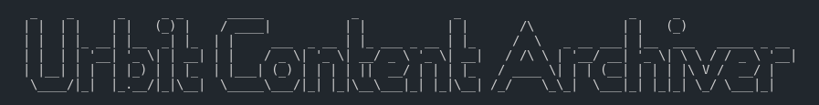
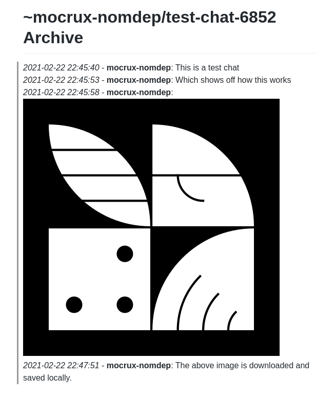

The Urbit Content Archiver is a small CLI application that exports channels from your Urbit ship and auto-downloads any directly linked content locally in order to preserve and archive the content for the future. The archiver supports media files (jpg, png, gif, mp3, flac, mkv, mp4, flc, etc.), archives (zip, 7z, tar, etc.), torrents, and text-based files (epub, pdf, doc, txt, etc.)

This application uses the [Rust Urbit HTTP API Crate](https://crates.io/crates/urbit-http-api).

## Using The Urbit Content Archiver

```
Usage:
        urbit-content-archiver chat <ship> <name> [--config=<file_path> --output=<folder_path>]
        urbit-content-archiver notebook <ship> <name> [--config=<file_path> --output=<folder_path>]
Options:
      --config=<file_path>  Specify a custom path to a YAML ship config file.
      --output=<folder_path>  Specify a custom path where the output files will be saved.

```

As can be seen above, the Urbit Content Archiver is quite straightforward to use. It uses a non-interactive interface in order to allow it to be interoperable with other tools/applications. This allows for setting up cron-jobs to say archive a chat every X hours, setup hotkeys to do it on-command, or anything you can imagine in between. Any previously archived content is skipped over (not downloaded again), thereby allowing you to keep running the archiver on the same channels and only downloading new content.

## Current Supported Commands & Flags

### `chat`



This command allows you to export and archive any chat which your ship has joined as a markdown file. Any content files that are linked to in the chat will be automatically downloaded locally and linked within the markdown as well.

It can be used as such:

```sh
./urbit-content-archiver chat ~darrux-landes development
```

The chat graph will be requested from your ship (may take a number of seconds for your ship to process the request depending on chat size), and then once received, processed into a clean markdown formatting style as seen above (do note the above is a processed preview from the markdown).

The markdown chat archive is saved locally as `<ship>-<name>.md` and the downloaded content is stored in the `archived-content` folder.

### `notebook`

This command allows you to export and archive any notebook which your ship has joined as a markdown file. Any media or content files that are linked in the notebook (via the `[]()` markdown linking format) will be automatically downloaded locally and linked within the markdown as well.

It can be used as such:

```sh
./urbit-content-archiver notebook ~bollug-worlus index-weekly
```

The chat graph will be requested from your ship (may take a number of seconds for your ship to process the request depending on chat size), and then once received, processed into a clean markdown formatting style as seen above (do note the above is a processed preview from the markdown).

The markdown chat archive is saved locally as `<ship>-<name>.md` and the downloaded content is stored in the `archived-content` folder.

### `--config=<file_path>`

This flag allows you to specify which ship config yaml file to use via file path. This and other flags can be useful for many circumstances, such as setting up a cron job.

### `--output=<folder_path>`

This flag allows you to specify the output folder path where the archived data will be saved.

## Building The Application

Ensure that you have the [latest version of Rust installed](https://rustup.rs/) and the `libssl-dev` package on Ubuntu (aka `openssl-devel` on Fedora, and potentially slightly different on other distros).

1. Clone this repository and enter into the folder.

2. Run the setup script which will compile and prepare everything for you.

```sh
sh setup.sh
```

3. The Urbit Content Archiver application will be compiled, moved into the `deployed` folder, and begin using the application.

4. Use the archiver:

```sh
./urbit-content-archiver chat ~darrux-landes development
```

5. If you haven't specified one already, the `ship_config.yaml` will be automatically generated for you and will require editing to add your Urbit ship's ip/port/`+code`.
