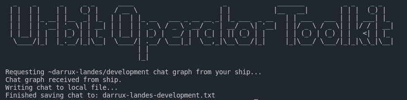

The Urbit Operator Toolkit is a small CLI application that interacts with your ship externally and exposes various useful functionality as a ship operator.

The first feature of the toolkit is the ability to export chat logs from any chat which your ship has joined. Further useful "tools" will be added over time as the [Rust Urbit HTTP API Crate](https://crates.io/crates/urbit-http-api) continues to be updated and supports further use cases.

## Using The Toolkit

```
Usage:
        urbit-operator-toolkit chat export <chat-ship> <chat-name> [--config=<file_path> --output=<folder_path>]
Options:
      --config=<file_path>  Specify a custom path to a YAML ship config file.
      --output=<folder_path>  Specify a custom path where the output file will be saved.

```

As can be seen above, the Urbit Operator Toolkit is quite straightforward to use. It uses a non-interactive interface in order to allow the toolkit to be interoperable with other tools/applications. This allows for setting up cron-jobs to say backup a chat every X hours, setup hotkeys to do it on-command, or anything you can imagine in between.

## Current Supported Commands & Flags

### `chat export`

This command allows you to export the chat log from any chat which your ship has joined.

It can be used as such:

```sh
./urbit-operator-toolkit chat export ~darrux-landes development
```

The chat graph will be requested from your ship (may take a number of seconds for your ship to process the request depending on chat size), and then once received, processed into a clean formatting style as seen below (do note all times are in UTC):

```
2020-04-29 01:19:06 - ~risruc-habteb: which is the head of the subject, i.e., the type of `versioned-state` from the line above.
2020-04-29 01:21:50 - ~risruc-habteb: then, every time you do `=^  cards  state`
2020-04-29 01:23:10 - ~sarpen-laplux: the general pattern is that it's replacing a part in the subject, usually the state or something in the state, and then producing a set of effects to return. but it could be used for things other than state and effects, but it's very useful for that
```

This is saved as a local text file as `<chat_ship>-<chat_name>.txt`.

### `--config=<file_path>`

This flag allows you to specify which ship config yaml file to use via file path. This and other flags can be useful for many circumstances, such as setting up a cron job.

### `--output=<folder_path>`

This flag allows you to specify the output folder path where the output file will be saved.

## Building The Toolkit

Ensure that you have the [latest version of Rust installed](https://rustup.rs/) and the `libssl-dev` package on Ubuntu (aka `openssl-devel` on Fedora, and potentially slightly different on other distros).

1. Clone this repository and enter into the folder.

2. Run the setup script which will compile and prepare everything for you.

```sh
sh setup.sh
```

3. The Urbit Operator Toolkit application will be compiled, moved into the `deployed` folder, and a config file will be generated automatically for you.

4. Edit `ship_config.yaml` with your Urbit ship's ip/port/`+code`.

5. Use the toolkit:

```sh
./urbit-operator-toolkit
```
